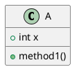
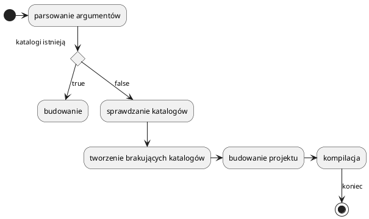
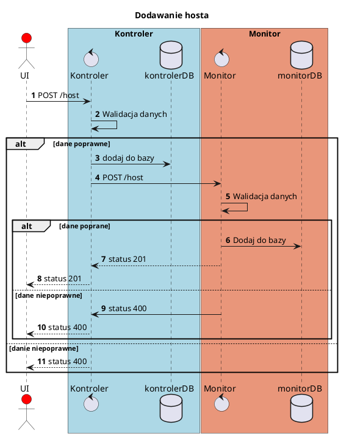
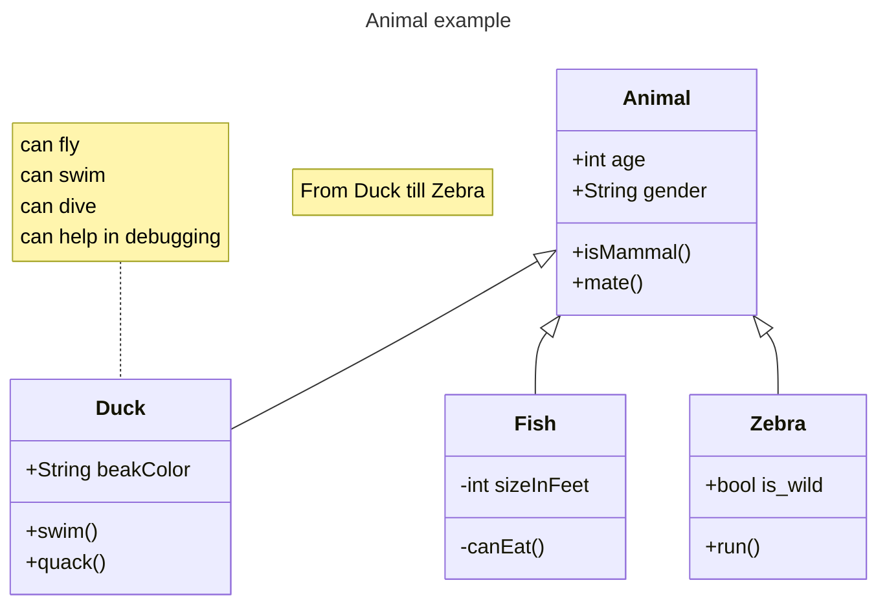
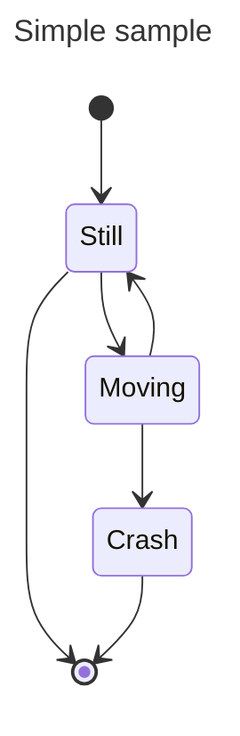
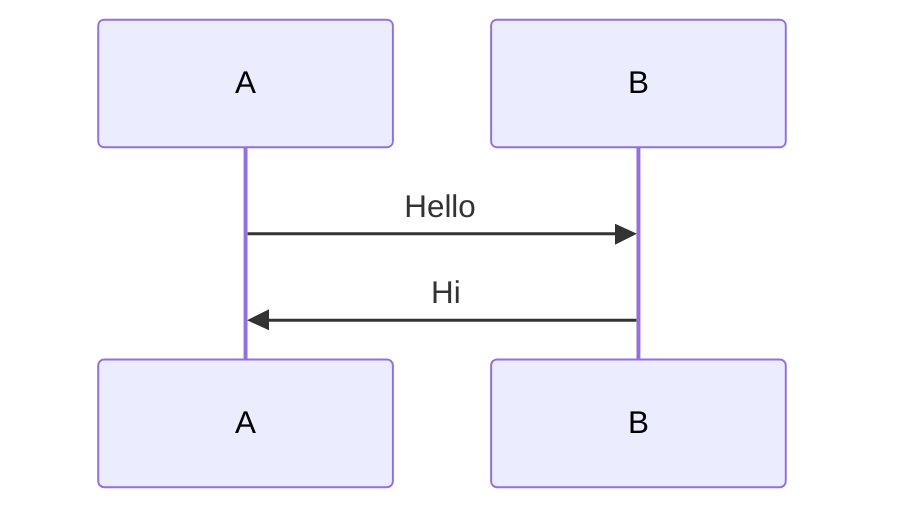
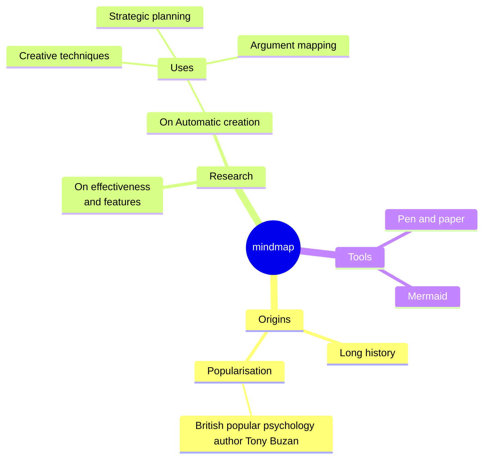
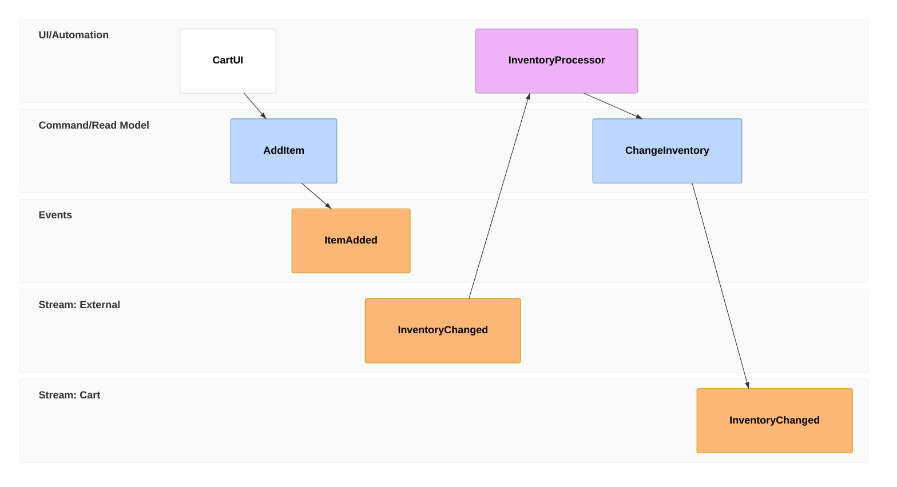

# UML Diagrams

This section provides an overview of UML diagrams and their usage in software development.

## Plantuml

PlantUML is a popular tool for creating UML diagrams using simple text-based descriptions. It supports various diagram types such as class diagrams, sequence diagrams, and activity diagrams.

### Class Diagram

### Activity Diagram

### Sequence Diagram

## Mermaid

Mermaid is another tool for creating UML diagrams and flowcharts. It uses a simple syntax and can be integrated with Markdown files. Mermaid supports sequence diagrams, flowcharts, and class diagrams.

### Class Diagram

### State Diagram

### Sequence Diagram

### Mindmap

### Architecture

```mermaid

architecture-beta
    group api(logos:aws-lambda)[API]

    service db(logos:aws-aurora)[Database] in api
    service disk1(logos:aws-glacier)[Storage] in api
    service disk2(logos:aws-s3)[Storage] in api
    service server(logos:aws-ec2)[Server] in api

    db:L -- R:server
    disk1:T -- B:server
    disk2:T -- B:db

```

### Event Modeling

