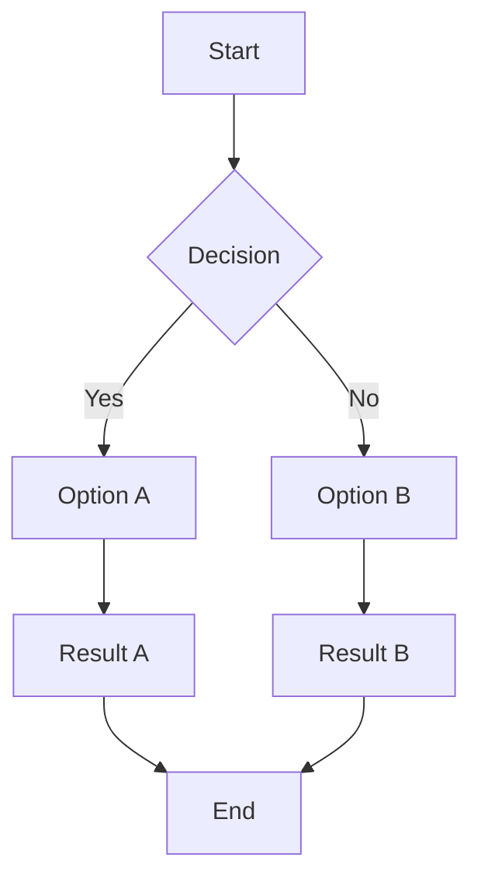
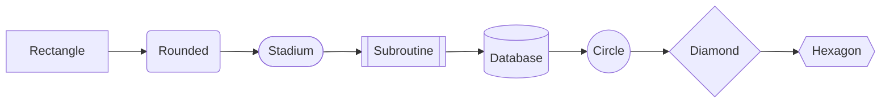
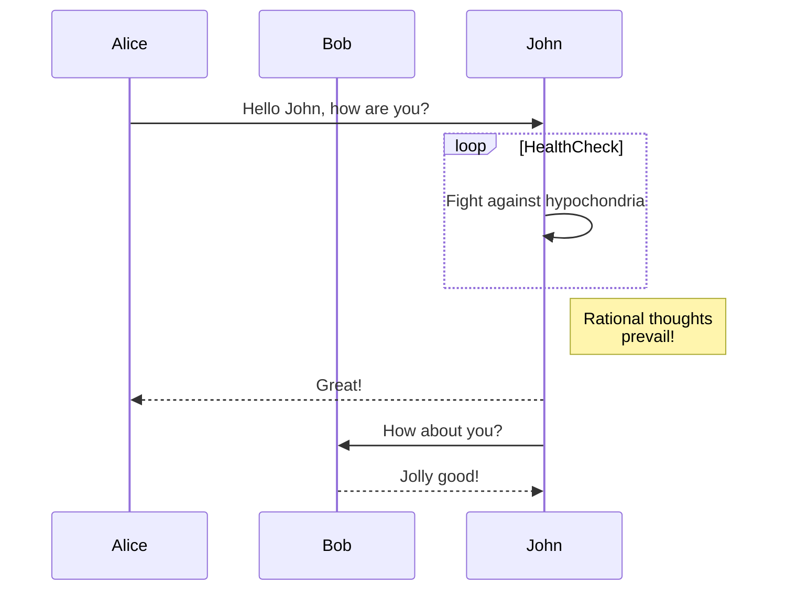
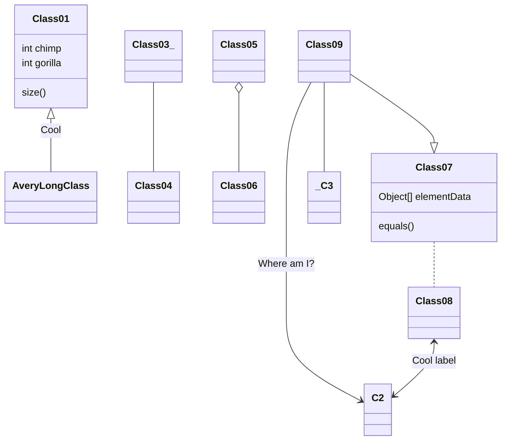
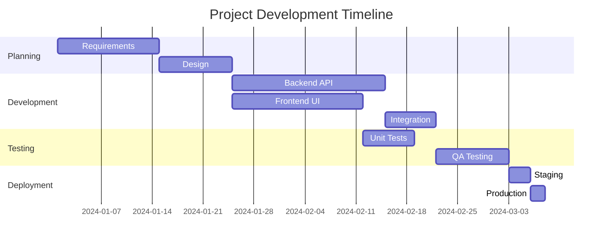
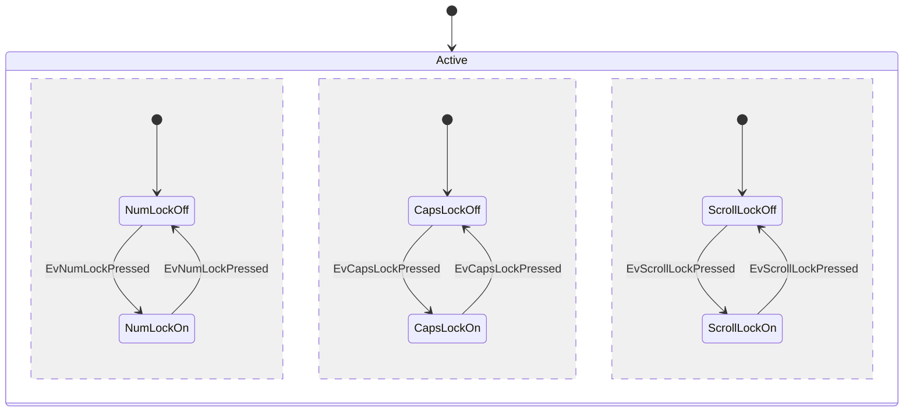

# Mermaid Diagrams

  

      
    

    

      <h1 style="margin: 0 0 12px 0; color: #ff3670; font-size: 32px;">Mermaid Diagrams</h1>
      
Create diagrams and flowcharts from text using Mermaid.js syntax

    

  

[TOC]

## Overview

DocOps Converter now supports **Mermaid.js** diagrams directly within your Markdown documentation. Mermaid is a JavaScript-based diagramming tool that renders Markdown-inspired text definitions to create and modify diagrams dynamically.

Simply write your diagram definition inside a fenced code block with the `mermaid` language identifier, and DocOps will render it as an interactive SVG diagram.

  
📊 Diagrams as Code

  
Mermaid lets you create complex diagrams using simple text syntax. Version control your diagrams alongside your code!

---

## Supported Diagram Types

DocOps supports all major Mermaid diagram types:

| Diagram Type | Description |
|--------------|-------------|
| **Flowchart** | Process flows and decision trees |
| **Sequence** | Interaction between actors/systems |
| **Class** | Object-oriented class structures |
| **State** | State machine diagrams |
| **Entity Relationship** | Database schemas |
| **Gantt** | Project timelines |
| **Kanban** | Task boards |
| **Pie** | Proportional data |
| **Git Graph** | Branch visualization |
| **Mindmap** | Hierarchical ideas |

---

## Flowchart

Flowcharts are the most common Mermaid diagram type. Use them to visualize processes, algorithms, and decision flows.

### Direction Options

- `TD` or `TB` — Top to bottom
- `BT` — Bottom to top
- `LR` — Left to right
- `RL` — Right to left

### Node Shapes

---

## Sequence Diagrams

Visualize interactions between participants over time.

### Message Types

| Syntax | Description |
|--------|-------------|
| `->` | Solid line without arrow |
| `-->` | Dotted line without arrow |
| `->>` | Solid line with arrow |
| `-->>` | Dotted line with arrow |
| `-x` | Solid line with cross |
| `--x` | Dotted line with cross |

---

## Class Diagrams

Document object-oriented designs and relationships.

### Relationship Types

| Symbol | Description |
|--------|-------------|
| `<\|--` | Inheritance |
| `*--` | Composition |
| `o--` | Aggregation |
| `-->` | Association |
| `..>` | Dependency |
| `..\|>` | Realization |

---

## Gantt Charts

Visualize project timelines and task dependencies.

---

## Kanban Boards

Visualize workflow and task status.

```mermaid
---
config:
  kanban:
    ticketBaseUrl: 'https://mermaidchart.atlassian.net/browse/#TICKET#'
---
kanban
Todo
[Create Documentation]
docs[Create Blog about the new diagram]
[In progress]
id6[Create renderer so that it works in all cases. We also add some extra text here for testing purposes. And some more just for the extra flare.]
id9[Ready for deploy]
id8[Design grammar]@{ assigned: 'knsv' }
id10[Ready for test]
id4[Create parsing tests]@{ ticket: MC-2038, assigned: 'K.Sveidqvist', priority: 'High' }
id66[last item]@{ priority: 'Very Low', assigned: 'knsv' }
id11[Done]
id5[define getData]
id2[Title of diagram is more than 100 chars when user duplicates diagram with 100 char]@{ ticket: MC-2036, priority: 'Very High'}
id3[Update DB function]@{ ticket: MC-2037, assigned: knsv, priority: 'High' }

id12[Can't reproduce]
id3[Weird flickering in Firefox]

```

---

## State Diagrams

Model state machines and transitions.

### Interactive Features

    DocOps renders Mermaid diagrams with built-in interactive controls:

- **VIEW** — Open diagram in a modal for closer inspection
- **SVG** — Copy the SVG source code to clipboard
- **PNG** — Export as PNG image

💡 Pro Tip

Mermaid diagrams are rendered client-side, so they adapt to your page's theme and can be interacted with directly in the browser.

---

## Best Practices

### Keep It Simple

- Break complex diagrams into smaller, focused diagrams
- Use clear, descriptive labels
- Limit the number of nodes for readability

### Consistent Styling

- Use consistent node shapes for similar concepts
- Apply styling with classDef for uniform appearance
- Choose appropriate direction for your content flow

### Documentation Integration

- Use diagrams to supplement text explanations
- Place diagrams near the content they illustrate
- Include alt text descriptions for accessibility

---

## Resources

- [Mermaid Official Documentation](https://mermaid.js.org/intro/)
- [Live Editor](https://mermaid.live/)
- [Mermaid GitHub Repository](https://github.com/mermaid-js/mermaid)
