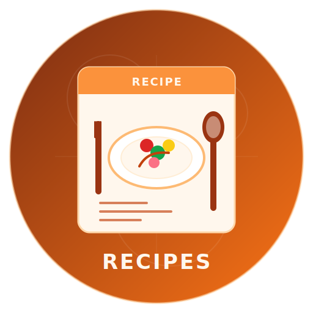

# DocOps Recipes

<div style="background: white; border: 2px solid #e2e8f0; border-radius: 12px; padding: 32px; margin-bottom: 48px; box-shadow: 0 4px 6px rgba(0, 0, 0, 0.05);">
  <div style="display: flex; align-items: center; gap: 24px;">
<div style="background: linear-gradient(135deg, #7c2d12 0%, #f97316 100%); padding: 20px; border-radius: 12px;">
      
    </div>
    <div>
      <h1 style="margin: 0 0 12px 0; color: #7c2d12; font-size: 32px;">DocOps Recipes</h1>
      <p style="margin: 0; color: #64748b; font-size: 16px;">Create beautiful, structured cooking recipes with ingredients, steps, and notes</p>
    </div>
  </div>
</div>

[TOC]

## What are DocOps Recipes?

The DocOps recipe macro is designed to present food recipes in a clean, structured format. It helps you document ingredients, preparation steps, timings, and notes in a way that is easy to read and visually appealing.

Recipes are ideal for:

- **Cookbooks** - Present recipe collections consistently
- **Meal Planning** - Organize weekly meals and shopping lists
- **Food Blogs** - Turn structured recipe text into polished documentation
- **Kitchen References** - Keep preparation and cooking details together
- **Training Materials** - Standardize recipe formatting for teams


## Default Look

[docops:recipe]
title= Curry Mango
yield= 4 servings
prep= 15 minutes
cook= 20 minutes
tags= curry, fruit, vegetarian
summary=
A fragrant and colorful curry with mango, vegetables, and warm spices.
ingredients=
- 2 ripe mangoes
- 1 onion
- 2 cloves garlic
- 1 tbsp curry powder
- 1 cup coconut milk
- 2 cups mixed vegetables
- Salt to taste
  steps=
1. Sauté the onion and garlic until fragrant.
2. Add curry powder and stir briefly.
3. Add vegetables, mango, and coconut milk.
4. Simmer until the vegetables are tender.
5. Serve warm with rice.
   notes=
- Adjust spice level to taste.
- Works well with jasmine rice or flatbread.
[/docops]

## Warm Comfort Food Look

[docops:recipe]
title= Root Vegetables with Salted Fish
yield= 3 servings
prep= 20 minutes
cook= 40 minutes
tags= savory, rustic, dinner
summary=
A hearty dish that balances earthy root vegetables with the depth of salted fish.
ingredients=
- 2 potatoes
- 2 carrots
- 1 sweet potato
- 150g salted fish
- 1 onion
- 2 tbsp oil
- Black pepper to taste
  steps=
1. Peel and chop the root vegetables into even pieces.
2. Soak or rinse the salted fish if needed.
3. Fry the onion until softened, then add the fish.
4. Add the vegetables and cook until tender.
5. Season and serve hot.
   notes=
- Add fresh herbs just before serving.
- Use less salt in the rest of the dish because the fish is already seasoned.
[/docops]

## Modern Dark Theme Look

[docops:recipe]
theme=classic
title= Chocolate Cake
yield= 8 slices
prep= 20 minutes
cook= 35 minutes
tags= dessert, cake, chocolate
summary=
A rich and simple chocolate cake with a soft crumb.
ingredients=
- 1 1/2 cups flour
- 1 cup sugar
- 1/2 cup cocoa powder
- 2 eggs
- 1/2 cup milk
- 1/2 cup oil
- 1 tsp baking powder
  steps=
1. Preheat the oven to 180C.
2. Mix the dry ingredients in a bowl.
3. Add the wet ingredients and stir until combined.
4. Pour into a greased pan and bake until set.
   notes=
- Cool before serving.
- Dust with icing sugar or frost as desired.
[/docops]

## Key Components of a Recipe

Each recipe typically includes:

1. **Title** - The name of the dish
2. **Yield** - Number of servings or quantity produced
3. **Prep Time** - Time needed to prepare ingredients
4. **Cook Time** - Time needed to cook or bake
5. **Tags** - Useful labels for categorization
6. **Summary** - Short description of the dish
7. **Ingredients** - Structured ingredient list
8. **Steps** - Ordered preparation instructions
9. **Notes** - Tips, variations, or serving suggestions
10. **Theme** - Visual styling option

## Supported Format

The recipe macro accepts simple key/value fields and multiline list sections.

### Basic Structure

```text 
[docops:recipe] 
title= Recipe Title 
yield= 4 servings 
prep= 15 minutes 
cook= 30 minutes tags= tag1, tag2, tag3 
summary= Short description of the recipe. 
ingredients=
- Ingredient 1
- Ingredient 2 steps=
1. First step
2. Second step notes=
- Optional note theme= classic 
[/docops]
```

### Field Guide

| Field | Purpose |
|---|---|
| `title` | Recipe title shown at the top |
| `yield` | Serving size or output amount |
| `prep` | Preparation time |
| `cook` | Cooking time |
| `tags` | Comma- or semicolon-separated tags |
| `summary` | Short description of the dish |
| `ingredients` | Ingredient list |
| `steps` | Step-by-step cooking instructions |
| `notes` | Extra tips, substitutions, or serving advice |
| `theme` | Visual theme name |

## Formatting Tips

- Use short, clear titles
- Keep ingredients in the order they are used
- Write each step as a single action
- Use notes for substitutions and serving suggestions
- Add tags to make recipes easier to browse

<div style="background: #f8fafc; border-left: 4px solid #f97316; padding: 16px 24px; margin: 32px 0; border-radius: 4px;">
  <p style="margin: 0; color: #7c2d12; font-weight: 600;">💡 Best Practice</p>
  <p style="margin: 8px 0 0 0; color: #475569;">Keep the recipe concise and scannable. A good recipe card should help the reader cook quickly without searching for key details.</p>
</div>