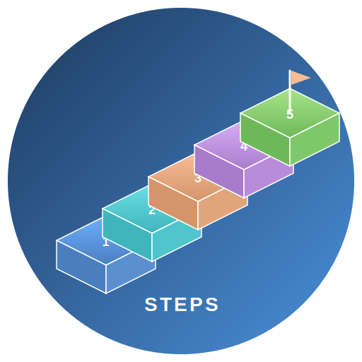

# DocOps Steps

<div style="background: white; border: 2px solid #e2e8f0; border-radius: 12px; padding: 32px; margin-bottom: 48px; box-shadow: 0 4px 6px rgba(0, 0, 0, 0.05);">
  <div style="display: flex; align-items: center; gap: 24px;">
<div style="background: linear-gradient(135deg, #1e3a5f 0%, #4a90d9 100%); padding: 20px; border-radius: 12px;">
      
    </div>
    <div>
      <h1 style="margin: 0 0 12px 0; color: #1e3a5f; font-size: 32px;">DocOps Steps</h1>
      <p style="margin: 0; color: #64748b; font-size: 16px;">Create beautiful isometric step infographics to visualize processes, workflows, and progress</p>
    </div>
  </div>
</div>

[TOC]

## What are DocOps Steps?

The DocOps steps macro generates isometric 3D step infographics from simple structured text. It helps you visualize processes, workflows, and progress in a clean, numbered format that is easy to read and visually compelling.

Steps are ideal for:

- **Process Documentation** - Visualize workflows and business processes
- **Onboarding Guides** - Show step-by-step user or employee onboarding
- **Project Milestones** - Display key phases of a project lifecycle
- **Training Materials** - Break down learning paths into clear stages
- **Product Roadmaps** - Illustrate feature development progression


## Default Look

[docops:steps]
infographic=isometric-steps
version=1
title=Enterprise Advantage Highlights
subtitle=Showcasing core strengths and performance across key dimensions
canvasWidth=1220
canvasHeight=760
theme=brand
palette=vibrant
---
Order | Title | Description | Color
1 | Brand Influence | Widely recognized and trusted by customers | #6EAEFF
2 | R&D Strength | Strong in-house innovation capabilities | #69DEE5
3 | Rapid Market Growth | Users and revenue grew quickly in one year | #F8BC95
4 | Service Excellence | High satisfaction and service quality scores | #D9AEF8
5 | Data Security | Robust protection and compliance systems | #B0A5FB
6 | Innovation Leadership | Advanced product and technology roadmap | #A7E58A
[/docops]

## Software Development Lifecycle

[docops:steps]
infographic=isometric-steps
version=1
title=Software Development Lifecycle
subtitle=Key phases from planning to deployment
canvasWidth=1220
canvasHeight=760
theme=classic
palette=vibrant
---
Order | Title | Description | Color
1 | Planning | Define requirements and project scope | #6EAEFF
2 | Design | Architect the solution and create specs | #69DEE5
3 | Development | Write and review code | #F8BC95
4 | Testing | Validate quality and fix defects | #D9AEF8
5 | Deployment | Release to production environment | #A7E58A
[/docops]

## Customer Onboarding Journey

[docops:steps]
infographic=isometric-steps
version=1
title=Customer Onboarding Journey
subtitle=Steps to welcome and activate new customers
canvasWidth=1220
canvasHeight=760
theme=brand
palette=vibrant
---
Order | Title | Description | Color
1 | Sign Up | Customer creates an account | #6EAEFF
2 | Verification | Identity and email verification | #69DEE5
3 | Profile Setup | Complete preferences and settings | #F8BC95
4 | First Use | Guided walkthrough of key features | #D9AEF8
5 | Engagement | Regular usage and feedback loop | #B0A5FB
[/docops]

## Road View

Use `view=road` to switch from the default isometric blocks to a winding road layout with connected step cards:

[docops:steps]
infographic=isometric-steps
version=1
title=Product Launch Roadmap
subtitle=From idea to market
canvasWidth=1220
canvasHeight=760
view=road
theme=ayu
palette=vibrant
---
Order | Title | Description | Color
1 | Ideation | Brainstorm and validate the concept | #6EAEFF
2 | Prototype | Build a working proof of concept | #69DEE5
3 | Beta Test | Gather feedback from early users | #F8BC95
4 | Refinement | Polish based on user insights | #D9AEF8
5 | Launch | Release to the public | #A7E58A
[/docops]

## Minimal Three-Step Process

[docops:steps]
infographic=isometric-steps
version=1
title=Quick Start Guide
canvasWidth=1220
canvasHeight=760
theme=classic
palette=vibrant
---
Order | Title | Description
1 | Install | Download and install the application
2 | Configure | Set up your preferences
3 | Launch | Start using the product
[/docops]

## Key Components

Each steps infographic includes two sections separated by `---`:

### Configuration Section

| Field          | Default      | Purpose                                      |
|----------------|--------------|----------------------------------------------|
| `infographic`  | _(required)_ | Type of infographic (use `isometric-steps`)  |
| `version`      | `1`          | Format version                               |
| `title`        | _(required)_ | Main title displayed on the infographic      |
| `subtitle`     | _(none)_     | Optional subtitle below the title            |
| `view`         | `isometric`  | View style: `isometric` (default 3D blocks) or `road` (winding road layout) |
| `canvasWidth`  | `1220`       | Width of the SVG canvas in pixels            |
| `canvasHeight` | `760`        | Height of the SVG canvas in pixels           |
| `theme`        | `classic`    | Visual theme name (e.g., `classic`, `brand`) |
| `palette`      | `vibrant`    | Color palette for step rendering             |
| `startX`       | _(auto)_     | Custom X starting position                   |
| `startY`       | _(auto)_     | Custom Y starting position                   |
| `dx`           | _(auto)_     | Horizontal offset between steps              |
| `dy`           | _(auto)_     | Vertical offset between steps                |
| `labelOffsetX` | `130`        | Horizontal offset for step labels            |
| `labelOffsetY` | `65`         | Vertical offset for step labels              |
| `maxDescLines` | `2`          | Maximum description lines per step           |

### Step Data Columns

| Column        | Required | Purpose                                    |
|---------------|----------|--------------------------------------------|
| `Order`       | Yes      | Numeric order of the step (must be unique) |
| `Title`       | Yes      | Short title for the step                   |
| `Description` | No       | Brief description text                     |
| `Color`       | No       | Custom hex color (e.g., `#6EAEFF`)         |

## Supported Format

The steps macro accepts a config block followed by pipe-delimited CSV data.

### Basic Structure

```text
[docops:steps]
infographic=isometric-steps
version=1
title=My Steps Title
subtitle=Optional subtitle text
canvasWidth=1220
canvasHeight=760
theme=classic
palette=vibrant
---
Order | Title | Description | Color
1 | Step One | Description of step one | #6EAEFF
2 | Step Two | Description of step two | #69DEE5
[/docops]
```

### Data Format Rules

- Config section and data section are separated by `---`
- First row after `---` is the header row
- Columns are separated by `|` (pipe)
- Order values must be unique integers
- Color is optional; palette colors are used when omitted

## Formatting Tips

- Keep titles short — use 2-3 words per step for best visual results
- Limit to 3-8 steps — too many steps reduce readability
- Use consistent colors — stick to a palette or let the theme handle it
- Write concise descriptions — one line per step works best
- Order sequentially — use 1, 2, 3... for clear progression
- Choose meaningful subtitles — they provide context for the entire infographic

<div style="background: #f8fafc; border-left: 4px solid #4a90d9; padding: 16px 24px; margin: 32px 0; border-radius: 4px;">
  <p style="margin: 0; color: #1e3a5f; font-weight: 600;">💡 Best Practice</p>
  <p style="margin: 8px 0 0 0; color: #475569;">Keep step titles short and action-oriented. Use the description field for additional context, and let the color palette create visual harmony unless you need specific brand colors.</p>
</div>
