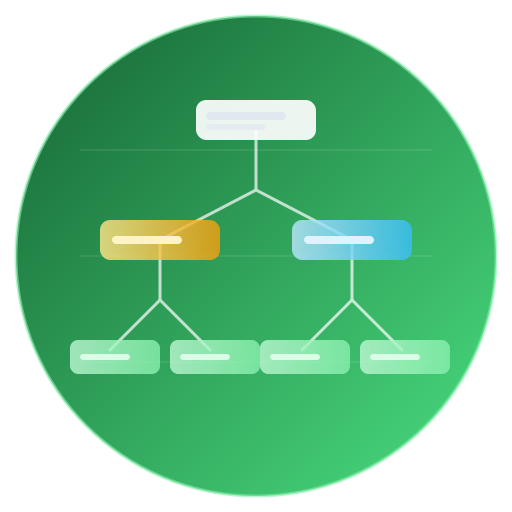

# DocOps Tree Chart Visualizer

<div style="background: white; border: 2px solid #e2e8f0; border-radius: 12px; padding: 32px; margin-bottom: 48px; box-shadow: 0 4px 6px rgba(0, 0, 0, 0.05);">
  <div style="display: flex; align-items: center; gap: 24px;">
    <div style="background: linear-gradient(135deg, #166534 0%, #4ade80 100%); padding: 20px; border-radius: 12px;">
      
    </div>
    <div>
      <h1 style="margin: 0 0 12px 0; color: #166534; font-size: 32px;">DocOps Tree Chart</h1>
      <p style="margin: 0; color: #64748b; font-size: 16px;">Visualize hierarchies like org charts, taxonomies, and system maps</p>
    </div>
  </div>
</div>

[TOC]

## What is DocOps Tree Chart?

DocOps Tree Chart converts indented lists into hierarchical diagrams. It is perfect for org charts, product taxonomies, and infrastructure hierarchies where structure matters.

### Key Features

- **Hierarchy visualization** - Convert indentation into tree structure
- **Flexible sizing** - Control canvas size for dense trees
- **Readable labels** - Clear node labeling for quick scanning
- **Great for structure docs** - Make org and system maps easy to understand

---

## Default Look

[docops:treechart]
title=Organization Chart
width=800
height=600
---
CEO
    CTO
        Engineering Manager
            Senior Developer
            Developer
            Junior Developer
        QA Manager
            QA Engineer
            QA Analyst
    CFO
        Finance Manager
            Accountant
            Financial Analyst
    CMO
        Marketing Manager
            Marketing Specialist
            Content Creator
[/docops]

---

## Product Taxonomy Example

[docops:treechart]
title=Product Taxonomy
width=800
height=520
---
Platform
    Core Services
        Auth
        Billing
        Notifications
    Data Layer
        Warehousing
        Analytics
    Experience
        Web App
        Mobile App
        Integrations
[/docops]

---

## Format Options

### Tree Chart Structure

Use indentation to indicate parent-child relationships:

```text
[docops:treechart]
title=Organization Chart
width=800
height=600
---
CEO
    CTO
        Engineering Manager
            Senior Developer
[/docops]
```

### Layout Options

- **title** - Chart title
- **width** - Canvas width in pixels
- **height** - Canvas height in pixels

---

## Best Practices

- **Keep depth reasonable** - 4-6 levels is usually enough
- **Use consistent naming** - Titles and labels should be uniform
- **Group by function** - Place similar nodes under the same parent
- **Adjust size for density** - Increase width/height for larger trees

<div style="background: #f0fdf4; border-left: 4px solid #4ade80; padding: 16px 24px; margin: 32px 0; border-radius: 4px;">
  <p style="margin: 0; color: #166534; font-weight: 600;">🌳 Tree Tip</p>
  <p style="margin: 8px 0 0 0; color: #475569;">If your tree is too dense to read, split it into multiple smaller charts by domain.</p>
</div>

---

## Common Use Cases

- **Organization charts** - Departments and reporting lines
- **System architecture** - Services and dependencies
- **Product taxonomy** - Feature grouping and ownership
- **Knowledge maps** - Categorized content structures
